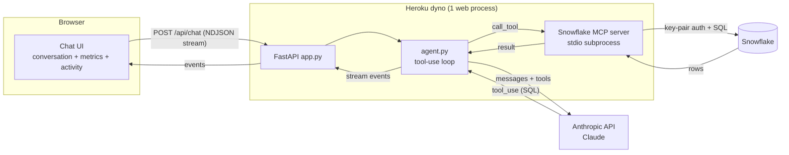
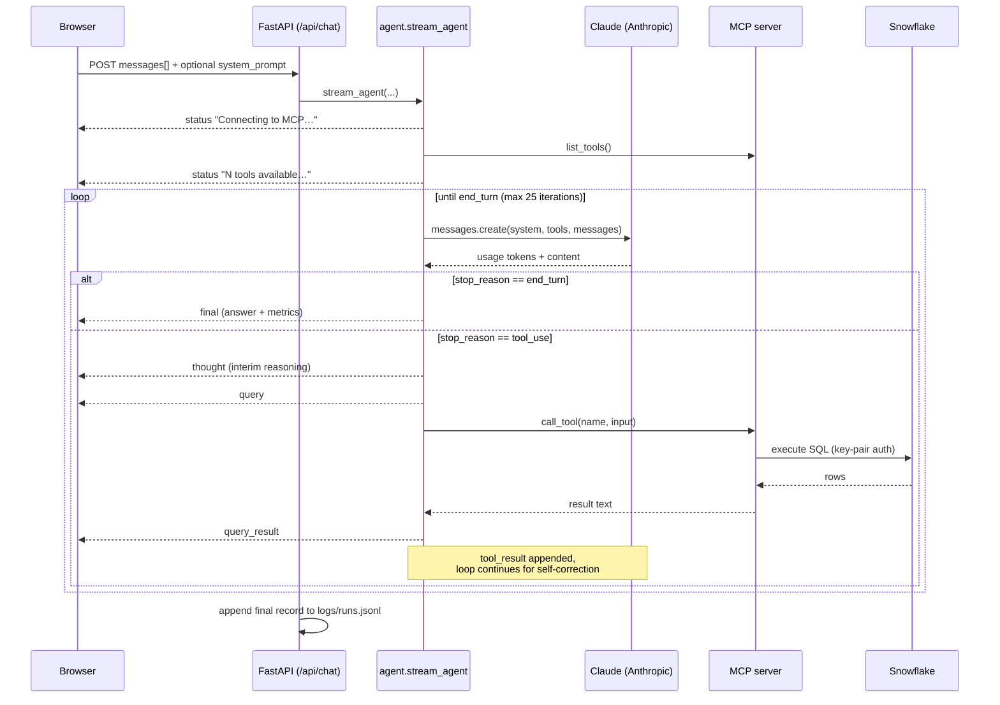
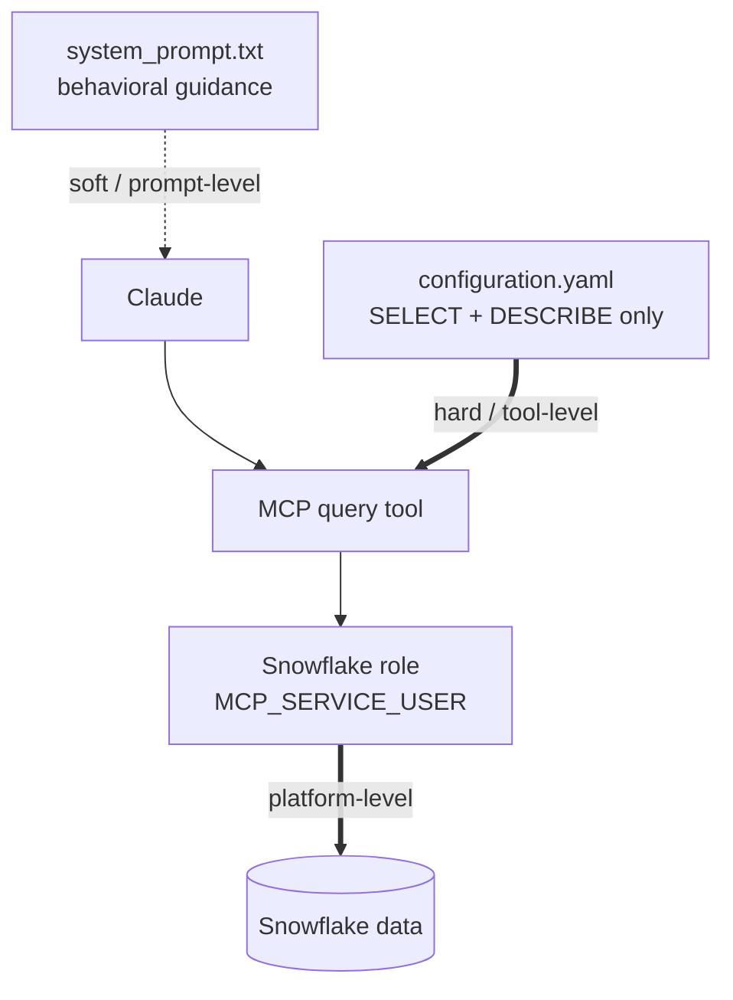
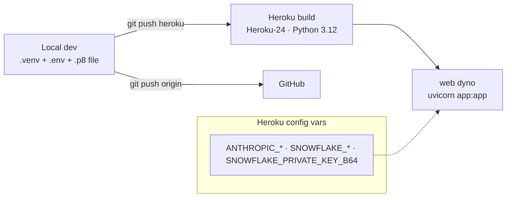

# Architecture — LLM + Snowflake MCP Demo

This document describes how the app is built, how a request flows end-to-end, and the
architectural properties that matter when comparing it to a governed enterprise platform
(Salesforce Headless AFD360). It's written to double as source material for slide decks.

For the narrative/demo script, see [`TALK_TRACK.md`](./TALK_TRACK.md). For setup and run
instructions, see [`README.md`](./README.md). For project intent, see [`CLAUDE.md`](./CLAUDE.md).

---

## 1. One-paragraph summary

A minimal FastAPI web app lets a banker ask natural-language questions about a customer.
Each question is sent to **Claude (Anthropic)**, which is given access to a single tool: a
**read-only SQL executor** exposed by the **Snowflake MCP server**. Claude writes its own
SQL, runs it against **Snowflake**, inspects the results, self-corrects on errors, and
iterates until it can answer. The server streams every step (tool calls, queries, results)
back to the browser as a live activity trace, and reports token, latency, and query-count
metrics per turn.

---

## 2. Component overview

| Component | File / location | Responsibility |
|---|---|---|
| **Web UI** | `static/index.html`, `app.js`, `style.css` | Chat interface, metrics panel, prepared prompts, editable system prompt, live activity trace |
| **Web server** | `app.py` (FastAPI) | HTTP endpoints, MCP lifecycle, streaming, request logging, secret handling |
| **Agent loop** | `agent.py` | Manual Anthropic tool-use loop; emits step events + per-turn metrics |
| **MCP server** | `snowflake-labs-mcp` (subprocess) | Exposes a read-only SQL tool; talks to Snowflake |
| **MCP config** | `services/configuration.yaml` | Restricts the MCP server to `SELECT` + `DESCRIBE` only |
| **Agent instructions** | `system_prompt.txt` | Persona, table guide, query/self-correction rules |
| **LLM** | Anthropic API (Claude) | Decides what SQL to run, interprets results, writes the answer |
| **Data** | Snowflake | Customer financial + CRM data (Salesforce Data Cloud datashare) |

---

## 3. Why these choices (design rationale)

The app follows the "ponytail" decision ladder from `CLAUDE.md`: build the minimum that
works, never cut security or error handling.

- **FastAPI + Uvicorn** — async-native, which matters because the whole request is an
  async stream of agent steps. Native `StreamingResponse` gives us the live activity trace
  with no extra framework.
- **Manual tool-use loop (not a higher-level agent SDK)** — we control the loop so we can
  capture *per-step* metrics (tokens, latency, every SQL string) and emit UI events. An
  opaque "agent.run()" would hide exactly the things this demo exists to show.
- **MCP over stdio subprocess** — the Snowflake MCP server is launched as a child process
  and spoken to over stdin/stdout via JSON-RPC. No network service to run; the official
  server handles Snowflake auth and SQL execution for us.
- **Read-only by configuration** — `configuration.yaml` exposes only the query tool and
  whitelists only `SELECT`/`DESCRIBE`. This is a guardrail at the tool layer, not just the
  prompt.
- **Single warm MCP session** — opened once at startup and reused, so we don't pay
  subprocess spawn + Snowflake login on every turn. Trade-off discussed in §8.

---

## 4. Request lifecycle (one turn)

Key points:
- The loop runs up to **`MAX_TOOL_ITERATIONS = 25`** times, letting Claude `DESCRIBE`
  tables, hit errors, and retry with corrected identifiers before answering.
- Both successful and failed tool results are fed back to Claude, so it **self-corrects**
  rather than giving up. Errors are detected heuristically via `_ERROR_MARKERS` for UI
  coloring only — the raw result always goes back to the model.
- Tokens are summed **across all iterations** in the turn; latency is wall-clock for the
  whole turn.

---

## 5. Streaming protocol (NDJSON event types)

`/api/chat` responds with `application/x-ndjson` — one JSON object per line. The browser
reads the stream incrementally and renders the activity box live.

| `type` | Fields | UI effect |
|---|---|---|
| `status` | `message` | Lifecycle line ("connecting", "N tools available") |
| `thought` | `message` | Claude's interim reasoning, shown italic |
| `query` | `n`, `tool`, `sql` | The SQL about to run |
| `query_result` | `n`, `ok`, `preview` | Success (✓) or error (✗) with a 240-char preview |
| `final` | `response`, `input_tokens`, `output_tokens`, `latency_ms`, `snowflake_queries`, `queries` | Renders answer + updates metrics |
| `error` | `message` | Surfaces a failure as an assistant error bubble |

Only the `final` event is persisted to `logs/runs.jsonl` (with a timestamp and
`architecture: "mcp"` tag) for post-demo analysis.

---

## 6. Data & schema

- **Financial data:** `FINS.PUBLIC.FINANCIAL_TRANSACTIONS`
- **CRM / relationship data:** Salesforce Data Cloud objects zero-copied into Snowflake
  under `FINSDC3_DATASHARE."schema_Jedi_Snowflake"` (accounts, financial accounts,
  opportunities, cases, affiliations, campaigns, contacts, etc.).

Two schema realities the system prompt explicitly handles:
- **Case-sensitive identifiers** — the Data Cloud datashare uses mixed-case, quoted
  schema/table/column names. The model is told to double-quote them exactly.
- **Schema discovery** — the model is told to `DESCRIBE TABLE` and query
  `INFORMATION_SCHEMA` to confirm names before joining/filtering, instead of guessing
  Salesforce-style field names.

The same underlying dataset feeds the AFD360 app, so the two architectures are compared on
identical data — no cherry-picking.

---

## 7. Security & guardrails

- **Tool-level (hard):** `configuration.yaml` exposes only `query_manager` and whitelists
  only `SELECT`/`DESCRIBE`. Writes, DDL, `SHOW`/`CALL`/`GRANT`, and anything unmapped are
  blocked regardless of what the model asks for.
- **Prompt-level (soft):** `system_prompt.txt` shapes behavior but is advisory — and in
  this demo it's even editable per-session from the browser (see §9).
- **Identity:** all queries run as a **single Snowflake service identity**
  (`MCP_SERVICE_USER` / role from env). There is **no per-banker identity** flowing to the
  data layer — a key point in the enterprise comparison (§10).
- **Credentials:** Snowflake uses **key-pair auth**. Locally the `.p8` is a file; on Heroku
  the key is stored as a base64 config var (`SNOWFLAKE_PRIVATE_KEY_B64`) and decoded to a
  temp file at boot (`_ensure_private_key_file`). Secrets are never committed (`.gitignore`).

---

## 8. Deployment

- **Procfile:** `web: uvicorn app:app --host 0.0.0.0 --port $PORT --workers 1`
  - **`--workers 1` is required, not incidental.** Each uvicorn worker runs its own copy
    of the app, and each app instance spawns its **own** Snowflake MCP subprocess at
    startup. Heroku's Python buildpack defaults `WEB_CONCURRENCY` to 2 on a 512 MB dyno, so
    without this flag you get 2 workers → 2 MCP servers → 2 Snowflake connections, which
    both exceeds the memory quota (`Error R14`) and breaks the single-warm-session model.
    Pinning to one worker keeps memory in budget and preserves the single-session design
    (§8 concurrency note). A `WEB_CONCURRENCY=1` config var is also set on the deployed app
    as belt-and-suspenders.
- **Runtime:** Python 3.12 (`.python-version`), pinned deps (`requirements.txt`).
- **Local vs Heroku key handling:** `_ensure_private_key_file()` bridges the gap — file
  path locally, decoded temp file from a config var on Heroku's ephemeral filesystem.
- **MCP command resolution:** `_mcp_command()` uses the installed `snowflake-labs-mcp`
  console script on Heroku, falling back to `uvx` locally.
- **`fastmcp` pinned `<3`** (currently `==2.14.7`): `snowflake-labs-mcp` depends on the 2.x
  line; 3.0 is breaking. Pinning makes builds reproducible.

**Concurrency note:** the app uses one warm MCP session (one Snowflake service connection)
shared across requests. Correct and isolated for read-only queries at demo scale (the MCP
SDK routes concurrent JSON-RPC calls by id), with at most minor queueing latency. It is
**not** built for production multi-tenant load — see §10.

---

## 9. State model (what lives where)

| State | Location | Lifetime |
|---|---|---|
| Conversation history | Browser, sent on every request | Until "Clear chat" / refresh |
| Session metrics (tokens, cost, turns) | Browser | Until clear / refresh |
| Edited system prompt | Browser (sent per request as `system_prompt`) | **Session-only — resets to disk default on refresh** |
| Default system prompt | `system_prompt.txt` on the server | Permanent (deploy-time) |
| Per-turn run records | `logs/runs.jsonl` (gitignored, ephemeral on Heroku) | Until dyno restart |

The server holds **no per-user mutable state**. This is deliberate: multiple people can
demo simultaneously without interfering with each other, and a refresh always returns to
the canonical default. (Heroku's filesystem is ephemeral, so `logs/runs.jsonl` is for local
analysis; it does not persist across dyno restarts.)

---

## 10. Architectural comparison to AFD360 (for slides)

Both architectures answer the same question on the same data. The difference is everything
*around* the answer at enterprise scale.

| Dimension | LLM + MCP (this app) | Headless AFD360 (governed platform) |
|---|---|---|
| **How an answer is produced** | Model improvises SQL, self-corrects, iterates | Named, predefined actions against records |
| **Identity** | One shared service account for all users | Each user's real identity carried end-to-end |
| **Authorization** | Broad service-role read access | Per-user permissions, sharing rules, field-level security |
| **Auditability** | Reconstructed from query logs; no business-action record | Every invocation is an auditable action with an ID |
| **Consistency** | Same prompt → possibly different SQL/answer | Deterministic, repeatable |
| **Semantic consistency** | "Relationship value" = whatever the model computes that run | Defined once in the semantic model |
| **Cost** | Token cost scales with breadth/retries; Snowflake compute opaque | Predictable, governed compute |
| **Governance surface** | Prompt + tool config (one editable) | Platform-enforced policy |
| **Time to first value** | Days, one engineer | Longer; requires modeling/config |
| **Best fit** | Prototyping, exploration, internal tools | Regulated, multi-user, operationalized workflows |

**The scaling insight:** making this prototype safe for hundreds of bankers isn't a
connection-pool problem — it requires rebuilding per-user identity, entitlements, and
audit. That substrate is exactly what the governed platform provides out of the box. The
prototype proves the value; the platform operationalizes it.

---

## 11. Tech stack reference

| Layer | Technology | Version |
|---|---|---|
| Web framework | FastAPI | 0.137.1 |
| ASGI server | Uvicorn (standard) | 0.49.0 |
| LLM SDK | anthropic | 0.109.2 |
| MCP client SDK | mcp | 1.28.0 |
| MCP server | snowflake-labs-mcp | 1.4.2 |
| MCP framework (transitive) | fastmcp | 2.14.7 (`<3`) |
| Env loading | python-dotenv | 1.2.2 |
| Runtime | Python | 3.12 |
| Frontend | Vanilla HTML/CSS/JS + marked.js (CDN) | — |
| Host | Heroku (Heroku-24 stack) | — |
| Model | Claude (`claude-sonnet-4-5` default) | — |

---

## 12. Known limitations (by design)

- No authentication / multi-user identity.
- No persistent database; run logs are local/ephemeral.
- Single shared MCP session — not production concurrency.
- System prompt is advisory and user-editable (the point of the demo, not a bug).
- Minimal error handling — surfaces failures rather than recovering gracefully in all cases.

These are intentional per the "demo, not production" scope in `CLAUDE.md`.
